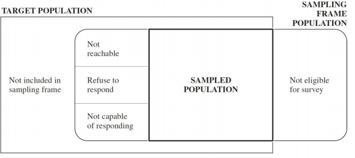

```{r setup, include=FALSE}
options(htmltools.dir.version = FALSE)
knitr::opts_chunk$set(collapse=TRUE, prompt=TRUE, comment=NULL, message = FALSE, warning = FALSE)
library(dplyr)
library(readr)
```

# Content:

- Examples of surveys

- Terminology

---

# What is a survey?
- Study designed to get a **snapshot of a population  at a
    particular period of time**.

- Examples: 

  - [What were opinions on voting by mail prior to the 2020 election?](https://www.surveymonkey.com/curiosity/nbc-poll-covid-aug30/)
  
  - [What are US demographics between census years?](http://www.census.gov/programs-surveys/acs/)
  
  - [How many moose are in northern MN?](https://www.dnr.state.mn.us/moose/index.html)


---

    
# Sampling Terminology

- **Observation unit/measurement unit/element** An object on which a measurement is taken.

- **Population** A collection of all observation units  at a particular
period of time.


---

    
# Sampling Terminology

-  **target population**: who we want to study

-  **sampled population**: who we actually sampled from
    
--



.footnote[Note: diagram assumes that we can identify everyone who is not eligible]

---

# Sampling Terminology


- **Sampling Unit** An element, or group of elements, which we
actually sample. Sampling units are nonoverlapping and must cover
the entire population.

- **Sampling Frame** A list of sampling units in a population (sampled population).

---

# Sampling Terminology


- **Sample** A collection of  units drawn from a sampling frame.

- **Sampling Design** A plan for selecting sampling units


---

# Sampling Terminology


- **Parameter** A particular population characteristic, usually a number, that we want to estimate in a survey.

---

# Sampling Terminology


- **Statistic** A number computed from a sample.

- **Sampling Error** Sample-to-sample variation in a statistic

    +  Sampling error is quantifiable if a probability sampling
design is used.
    + The **standard error** of a statistic is one way to measure sampling error.

---

# Sampling Terminology


- When a **probability sampling design** is used, statisticians can 
    - study how to **form estimates** of parameters from statistics given a particular **sampling design**
    
    - study how to quantify **sampling error** given a particular **sampling design** 
    
    - **compare** competing sampling designs to determine which is "better"

--

- More on this starting next week

---

# Sampling Terminology

- Non-sampling errors: any errors that aren't due to sample-to-sample variation (e.g. SE/margin of error)

  - more on this in Friday's video