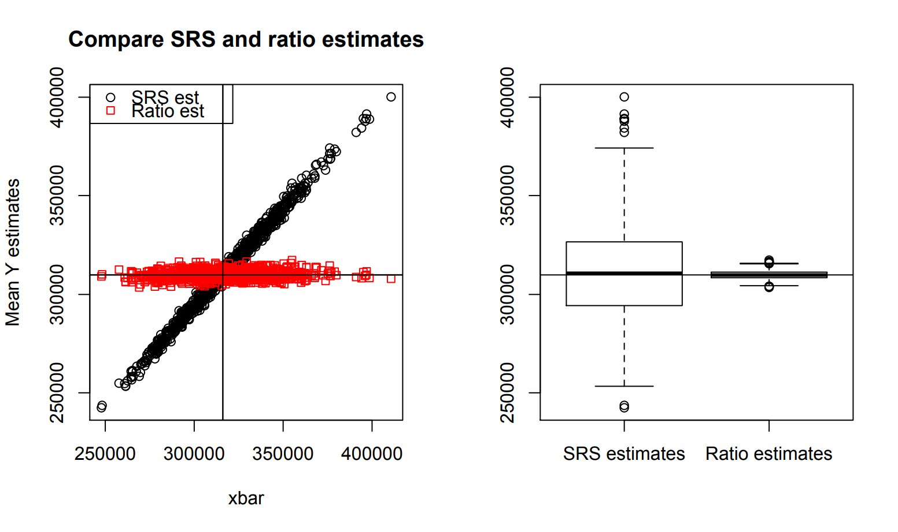

```{r setup, include=FALSE}
options(htmltools.dir.version = FALSE)
knitr::opts_chunk$set(collapse=TRUE, prompt=TRUE, comment=NULL, message = FALSE, warning = FALSE, fig.height = 7, fig.width = 11)
library(dplyr)
library(knitr)
library(here)
```

### Ratio estimators

- Estimate $\hat{B}$ and SE
```{r, eval=FALSE}
est.B <- svyratio(~y, ~x, design)	
```

- Estimate $\hat{t}_{y,r}$ and SE
```{r, eval=FALSE}
predict(est.B, tx)   # tx = KNOWN POPULATION total for x
```

- Estimate $\hat{\bar{y}}_{r}$ and SE
```{r, eval=FALSE}
predict(est.B, mnx)   # tx = KNOWN POPULATION mean for x
```

---

### Lohr Examples 4.2 and 4.3

We have a SRS of 300 counties taken from the population of 3078 counties.

```{r}
library(survey)
library(SDaA)
agsrs$n<- nrow(agsrs)
agsrs$N<- 3078
agsrs$wts<- agsrs$N/agsrs$n
design.srs<- svydesign(id= ~1, 
                       fpc= ~N, 
                       weights= ~wts, 
                       data= agsrs)
```

---

### Lohr Examples 4.2 and 4.3

Estimate the ratio of total 1992 acres devoted to farming $(y)$ to the total from 1987 $(x)$
$$B = \dfrac{ \sum_{i=1}^{N} y_{i}}{\sum_{i=1}^{N} x_{i}}$$


```{r}
ratio<-svyratio(~acres92, ~acres87, design.srs)  
ratio   #estimate/SE for B
confint(ratio, df=degf(design.srs))  # CI for B
```


---

### Lohr Examples 4.2 and 4.3

**Known:** total number of acres devoted to farming in 1987 was $t_{x} = 964,470,625$

Estimate the total number of farming acres in 1992 using a **ratio** estimate:
```{r}
ratio<-svyratio(~acres92, ~acres87, design.srs)  
tx <- 964470625    # pop. total from 1987 (example 4.2)
toty <- predict(ratio , tx)   # ratio estimate of 1992 total
toty
confint(ratio, df=degf(design.srs)) *tx  # ratio est. CI for 1992 total
```

---

### Lohr Examples 4.2 and 4.3

Compare the ratio estimate of total to the SRS estimate:
```{r}
toty
svytotal(~acres92,design.srs)   # compare to usual SRS est. of 1992 total
```


---

### Lohr Examples 4.2 and 4.3

**Known:** mean number of acres per county devoted to farming in 1987 was $964,470,625/3078$

Estimate the mean number of farming acres per county in 1992 using a **ratio** estimate:

```{r}
mnx<- tx/3078    # pop. mean from 1987
mny<-predict(ratio , mnx)  # ratio estimate of 1992 mean
mny
confint(ratio, df=degf(design.srs)) *mnx   # ratio CI of 1992 mean
svymean(~acres92, design.srs)    # usual SRS estimate of 1992 mean
```

---

### Lohr Examples 4.2 and 4.3

Why are the ratio estimates of 1992 total/mean more precise that SRS?



