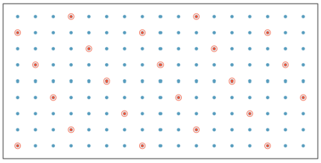
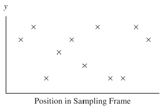
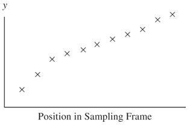

## Design: Systemaic  Sample 

**Loosely Defined**: Create an ordered list (sample frame) of observation units, randomly select a starting point and add every "k"th unit after. 

 
 

---

## Design: Systemaic  Sample 

**Defined**: 

- $M_0$ observation units

- $M$ units is the desired observation unit-level sample size

- Take a SRS of size 1 from the first $N = \dfrac{M_0}{M}$ units and include every $N$th unit after. 

---

## Design: Systemaic  Sample 

$M_0 = 12$, $M = 3$, $N = 12/3 = 4$

units | 1 | 2 | 3 | 4 | 5 | 6 | 7 | 8 | 9 | 10 | 11 | 12
--- | --- | ---  | --- | ---  | --- | ---  | --- | ---  | --- | --- | ---
possible samples | A | B  | C | D | A | B  | C | D | A | B  | C | D 

---

## Design: Systemaic  Sample 

Equivalent to a **one-stage** cluster sample of size $n=1$ from $N$ available clusters. 

- Estimated mean:

$$\hat{\bar{y}}_{sys} = \bar{y}$$

- SE: for large $N$

$$SE(\hat{\bar{y}}_{sys}) = \sqrt{ \left(1-\dfrac{1}{N}\right) \dfrac{s^2_t}{M^2}} \approx \sqrt{\dfrac{s^2}{M}\left( 1 + (M-1) ICC \right)}$$

---

## Design: Systemaic  Sample Scenarios

**Randomly ordered list** with respect to the response $y$

- $SSB \approx 0$ and $ICC \approx 0$ so 
$$SE(\hat{\bar{y}}_{sys}) \approx \sqrt{\dfrac{s^2}{M}} = SE(\bar{y}_{SRS})$$ 

---

## Design: Systemaic  Sample Scenarios

**Trending ordered list** with respect to the response $y$

- $ICC < 0$ so 
$$SE(\hat{\bar{y}}_{sys}) < \sqrt{\dfrac{s^2}{M}} = SE(\bar{y}_{SRS})$$ 

---

## Design: Systemaic  Sample Scenarios

**Periodic ordered list** with respect to the response $y$

- $SSW \approx 0$ and $ICC \approx 1$ so 
$$SE(\hat{\bar{y}}_{sys}) > \sqrt{\dfrac{s^2}{M}} = SE(\bar{y}_{SRS})$$ 

